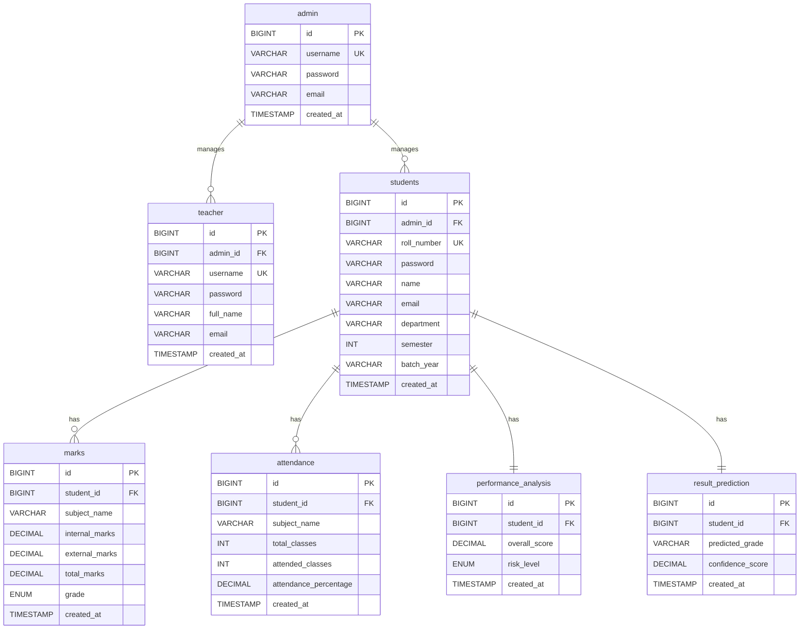

# Database: Student Performance Analytics System

This folder contains all database-related files for the **Student Performance Analytics & Result Prediction System**.

---

## 📂 Files in This Folder

| File | Description |
|------|-------------|
| `schema.sql` | Creates database + all 4 tables with constraints |
| `seed_data.sql` | Inserts 10 dummy students, marks & attendance |
| `queries.sql` | Useful analytical SQL queries |
| `er_diagram.png` | Entity-Relationship Diagram |

---

## 🗃️ Table Structure

### 1. `users` — Admin & Teacher Accounts
| Column | Type | Notes |
|--------|------|-------|
| id | BIGINT (PK) | Auto-increment |
| username | VARCHAR | UNIQUE, NOT NULL |
| password | VARCHAR | NOT NULL |
| full_name | VARCHAR | Display name |
| email | VARCHAR | Contact email |
| role | ENUM | `ADMIN` or `TEACHER` |

### 2. `students` — Enrolled Student Profiles
| Column | Type | Notes |
|--------|------|-------|
| id | BIGINT (PK) | Auto-increment |
| admin_id | BIGINT (FK) | → admin.id |
| roll_number | VARCHAR | UNIQUE, NOT NULL |
| password | VARCHAR | NOT NULL |
| name | VARCHAR | Full name |
| email | VARCHAR | Student email |
| department | VARCHAR | Dept. name |
| semester | INT | 1-8 |
| batch_year | VARCHAR | e.g. `2024` |

### 3. `marks` — Subject-wise Assessment Scores
| Column | Type | Notes |
|--------|------|-------|
| id | BIGINT (PK) | Auto-increment |
| student_id | BIGINT (FK) | → students.id |
| subject_name | VARCHAR | Subject title |
| internal_marks | DECIMAL | Max 40 |
| external_marks | DECIMAL | Max 60 |
| total_marks | DECIMAL | Auto-computed |
| grade | ENUM | `A+`,`A`,`B`,`C`,`D`,`F` |

### 4. `attendance` — Class Attendance Logs
| Column | Type | Notes |
|--------|------|-------|
| id | BIGINT (PK) | Auto-increment |
| student_id | BIGINT (FK) | → students.id |
| subject_name | VARCHAR | Subject title |
| total_classes | INT | Classes conducted |
| attended_classes | INT | Classes attended |
| attendance_percentage | DECIMAL | Auto-computed |

---

## 🚀 How to Set Up

### Option 1: MySQL (Production)
```sql
-- In your MySQL terminal or MySQL Workbench:
SOURCE schema.sql;
SOURCE seed_data.sql;
```

### Option 2: Spring Boot H2 (Testing - No Setup Required)
The Spring Boot backend uses an embedded H2 in-memory database automatically.
- Access the H2 web console at: **http://localhost:8080/h2-console**
- JDBC URL: `jdbc:h2:mem:student_performance_db`
- Username: `sa` | Password: *(empty)*

---

## 📊 ER Diagram


